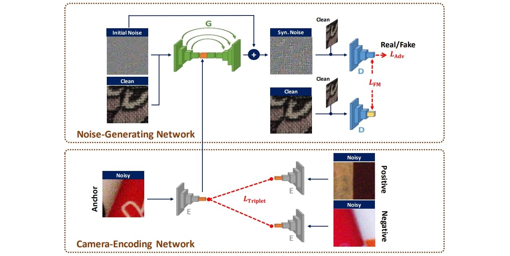
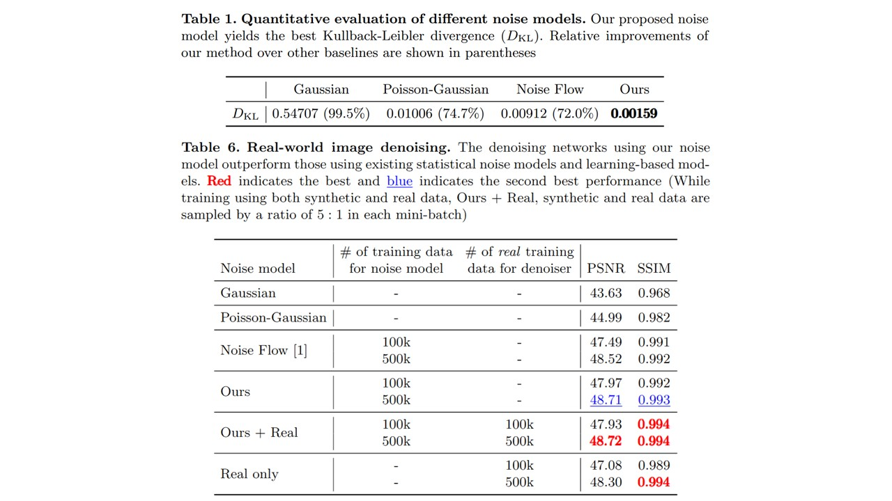

# [ECCV'20] CA-NoiseGAN


**[Project](https://arcchang1236.github.io/CA-NoiseGAN/)** | **[Paper](https://arxiv.org/abs/2008.09370)** | **[Abstract](https://youtu.be/_VWN8oLk68Q)** | **[Long Video](https://youtu.be/_gScv9bAdTE)**

## Overview

***CA-NoiseGAN*** is a **PyTorch** implementation of  
*"Learning Camera-Aware Noise Models"*,  
[Ke-Chi Chang](http://arcchang1236.github.io/), [Ren Wang](https://tw.linkedin.com/in/ren-wang-61b273160), [Hung-Jin Lin](https://github.com/leVirve), [Yu-Lun Liu](http://www.cmlab.csie.ntu.edu.tw/~yulunliu/), [Chia-Ping Chen](https://tw.linkedin.com/in/chia-ping-chen-81674078), [Yu-Lin Chang](https://scholar.google.com/citations?user=0O9rukQAAAAJ&hl=en), [Hwann-Tzong Chen](https://htchen.github.io/)  
in **European Conference on Computer Vision (ECCV) 2020** conference.



**Modeling imaging sensor noise** is a fundamental problem for image processing and computer vision applications. While most previous works adopt statistical noise models, real-world noise is far more complicated and beyond what these models can describe. To tackle this issue, we propose a data-driven approach, where **a generative noise model is learned from real-world noise**. The proposed noise model is camera-aware, that is, **different noise characteristics of different camera sensors can be learned** simultaneously, and a **single learned noise model can generate different noise for different camera sensors**. Experimental results show that our method quantitatively and qualitatively outperforms existing statistical noise models and learning-based methods.




## Requirements
This test code is implemented under **Python3**.  
Following libraries are required:

- [PyTorch](https://pytorch.org/) == 1.1.0
- see `requirements.txt` for more detail

If you want to visualize the results of Noise Flow, the libraries are also required:

- [TensorFlow](https://www.tensorflow.org/) == 1.13.0
- [tensorflow-probability](https://pypi.org/project/tensorflow-probability/) >= 0.5.0con

## Usage

1. **Prepare Data**  
   We prepare our test data as `Data.zip` in [[Google Drive]](https://drive.google.com/drive/folders/1jnv9rKEv1uTO7uyAf5fQCBHPL_4PCrhj?usp=sharing) and they are totally derived from SIDD dataset.
   Please unzip it and you can change the `data_dir` in `config.yml` into your data path.  

2. **Download Pretrained Models**  
   We provide pretrained baseline models of noise models and denoisers as `checkpoints.zip` in [[Google Dirve]](https://drive.google.com/drive/folders/1jnv9rKEv1uTO7uyAf5fQCBHPL_4PCrhj?usp=sharing).  
   Please unzip it under the root directory.

3. **Prepare Runtime Environment**  
   ```shell
   pip install -r requirements.txt
   ```

4. **Test the Noise Models and Denoisers**  
   You need to check the correctness of each path in `config.yml`.  
   Moreover, you can modify the amount of samples and patch size. See config.yml for more detail. Then, you can run the following scripts.
	- **Noise Models**
	  ```shell
	  python test_noise_models.py --config config.yml
	  ```

    - **Denoisers**
	  ```shell
	  python test_denoisers.py --config config.yml
	  ```

5. **Visual Results**  
   The results will be saved in `./samples/`, including raw images and sRGB images. We provide the metrices we used in our paper, you can evaluate the quantitative results of each model, too. 

## Citation
```
@InProceedings{CANoiseGAN,
	author = {Chang, Ke-Chi and Wang, Ren and Lin, Hung-Jin and Liu, Yu-Lun and Chen, Chia-Ping and Chang, Yu-Lin and Chen, Hwann-Tzong},
	title = {Learning Camera-Aware Noise Models},
	booktitle = {Proceedings of the European Conference on Computer Vision (ECCV)},
	year = {2020}
}
```

## Resources
- [SIDD Dataset](https://www.eecs.yorku.ca/~kamel/sidd/)
- [Noise Flow](https://github.com/BorealisAI/noise_flow) (Tensorflow)
- [Simple Camera Pipeline](https://github.com/AbdoKamel/simple-camera-pipeline) (Python, MATLAB)

## Acknowledgement
- [Mediatek Inc.](https://www.mediatek.tw/)
